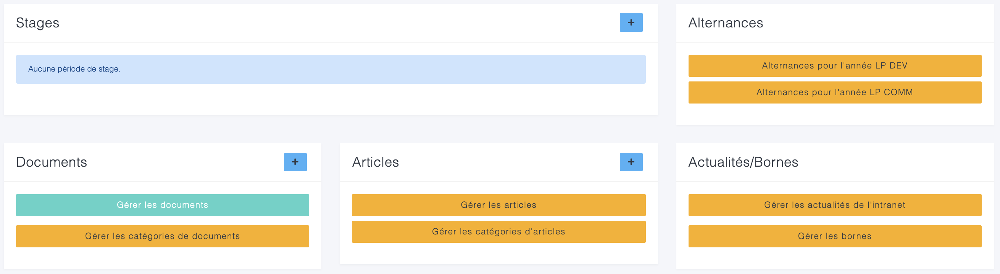
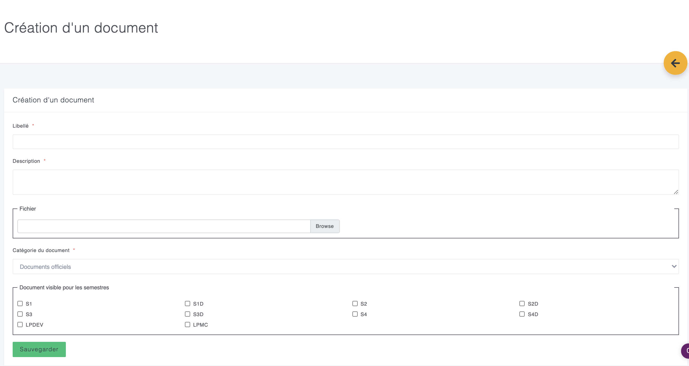

# Déposer un document

_Version du 02/09/2020_

Pour déposer un document sur l'intranet, il faut avoir le menu "administration" dans la barre latérale, comme ci-dessous.

Ensuite, sur la page d'administration, vous devez identifier le bloc "documents"


L'ordre et le nombre de blocs peut changer selon vos droits sur l'intranet.


Le plus en bleu, à droite de "Documents" permet de rapidement ajouter un document. Vous pouvez aussi gérer vos documents \(voir, modifier, supprimer\).

Vous pouvez aussi gérer les catégories de documents.


Une catégorie de document est obligatoire. Par défaut il n'existe pas de catégorie de document. Vous devez donc en ajouter une avant d'ajouter un document. Vous êtes libre d'en ajouter autant que nécessaire.


Vous complétez ensuite le formulaire avec les informations de votre document, en indiquant un titre, une courte description, la catégorie, les semestres qui pourront voir le document et le fichier \(pdf, word, excel, powerpoint\).


La taille maximale pour un document est de 10mo. Au delà, vous devrez utiliser un outil de partage et déposer un lien dans une actualité ou par mail.


L'ajout de document à destination des personnels et vacataires sera prochainement disponible.

