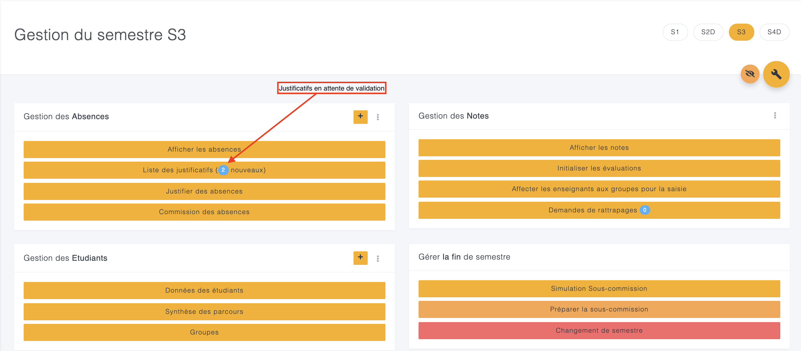
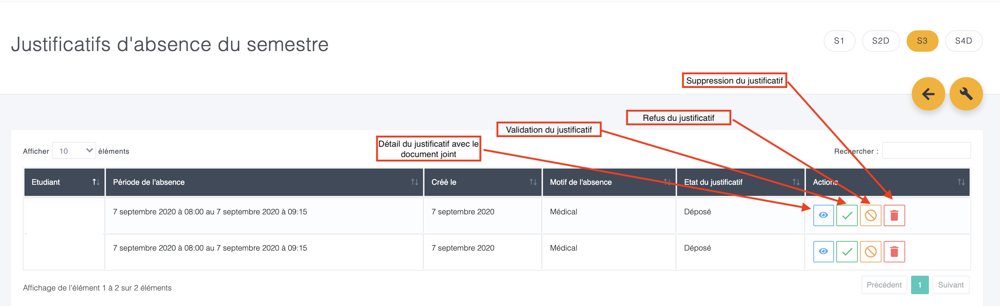

# Gérer les justificatifs d'absences

Les étudiants peuvent déposer un justificatif d'absence sur l'intranet \(voir la rubrique d'aide consacrée\).

Vous devez ensuite accepter ou refuser leurs justificatifs depuis la partie administration \(assistant\(e\)s, chefs de département, directeurs des études, responsables des absences\).

Dans un semestre, vous avez l'information du nombre de justificatifs en attente.

Lorsque vous choisissez "Liste des justificatifs \(xx nouveaux\)", vous obtenez la liste des justificatifs déposés.

Vous pouvez :

* Voir le détail d'un justificatif: dates, motifs, document joint
* Valider un justificatif : Dans ce cas toutes les absences sur la période sont justifiées, l'étudiant en est informé.
* Refuser un justificatif : L'étudiant est informé de la non prise en compte de sa demande. 
* Supprimer un justificatif \(en cas d'erreur de saisie par exemple\) : Le justificatif est supprimé, sans action sur les absences. L'étudiant est informé.

