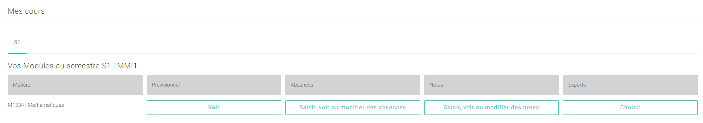
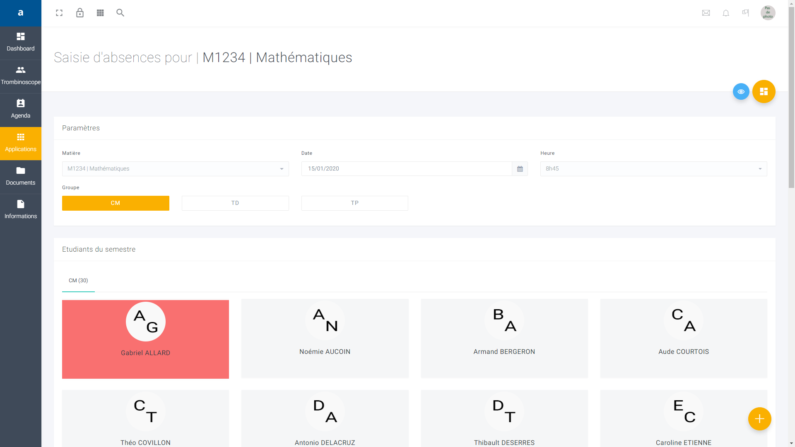

# Saisir, modifier, supprimer une absence

### Comment saisir une absence ?


_Attention ! Pour effectuer cette tâche vous devez au préalable vous connectez à votre **compte** **enseignant** ou votre **compte vacataire** \(voir la rubrique ci-dessus ou bien cliquez_ [_ici_](https://app.gitbook.com/@dannebicque/s/intranet/#comment-se-connecter-a-lintranet)_\)._




Pour saisir une absence, il suffit de descendre en bas de la page **Dashboard** où un espace nommé **Mes cours** est dédié à vos différentes actions en tant que professeur.

Une fois dans la rubrique **Mes Cours**, cliquez sur **Saisir voir ou modifier des absences** disponible dans la zone intitulée **Absences**. Vous êtes redirigé sur une page spécifique à la saisie d'absence qui ressemble à la suivante :

Vous devez ensuite remplir plusieurs paramètres propres à votre cours :  

* Le module que vous enseignez 
* La date du jour
* Le créneau horaire de votre cours 
* Le groupe que vous encadrez : CM pour Cours Magistral, TD pour Travaux Dirigés et TP pour Travaux Pratiques.

Une fois le groupe choisi, la liste des étudiants correspondant apparaît. Il ne vous reste plus qu'à cliquer sur l'étudiant qui n'était pas présent lors de votre cours afin de signaler son absence. La zone grisée deviendra rouge si l'étudiant est noté absent.

Si vous souhaitez vérifier que votre étudiant est bel et bien absent, rendez-vous sur le **trombinoscope**, vous y trouverez vos étudiants :

Cliquer sur la photo de profil ou le nom de votre étudiant absent :

Choisissez l'onglet **absences** :


_**Vous y trouverez toutes les absences de l'étudiant en question, ainsi que celles que vous avez saisies.**_


### Comment enlever une absence ?


_Attention ! Pour effectuer cette tâche vous devez au préalable vous connectez à votre **compte** **enseignant** ou votre **compte vacataire** \(voir la rubrique ci-dessus ou bien cliquez_ [_ici_](https://app.gitbook.com/@dannebicque/s/intranet/#comment-se-connecter-a-lintranet)_\)._




Pour saisir une absence, il suffit de descendre en bas de la page **Dashboard** où un espace nommé **Mes cours** est dédié à vos différentes actions en tant que professeur.

Une fois dans la rubrique **Mes Cours**, cliquez sur **Saisir voir ou modifier des absences** disponible dans la zone intitulée **Absences**. Vous êtes redirigé sur une page spécifique à la saisie d'absence qui ressemble à la suivante :

Vous devez ensuite remplir plusieurs paramètres propres à votre cours :  

* Le module que vous enseignez 
* La date du jour
* Le créneau horaire de votre cours 
* Le groupe que vous encadrez : CM pour Cours Magistral, TD pour Travaux Dirigés et TP pour Travaux Pratiques.

Une fois le groupe choisi, la liste des étudiants correspondant apparaît. Les étudiants absents lors de votre cours sont affichés en rouge. Pour retirer une absence, cliquez sur l'étudiant :

Si vous souhaitez vérifier que votre étudiant est bel et bien noté présent, rendez-vous sur le **trombinoscope**, vous y trouverez vos étudiants :

Cliquer sur la photo de profil ou le nom de votre étudiant :

Choisissez l'onglet **absences** :


_**L'absence de l'étudiant a bien été effacée.**_


