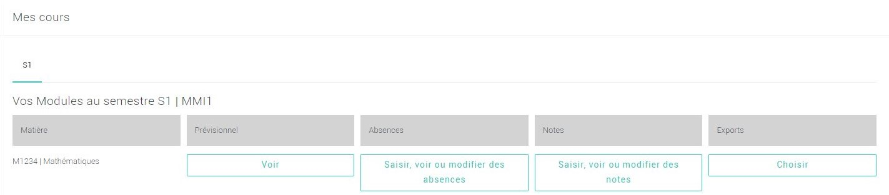
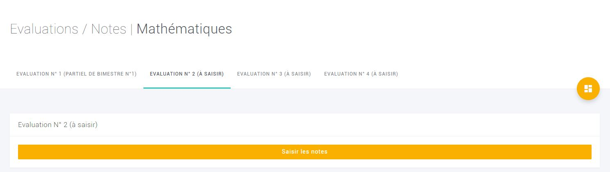
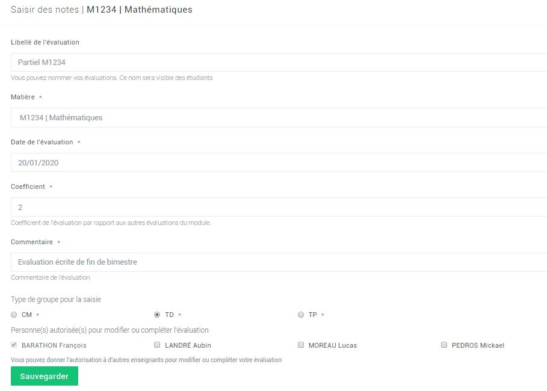
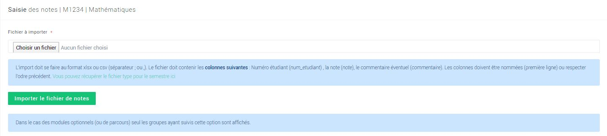
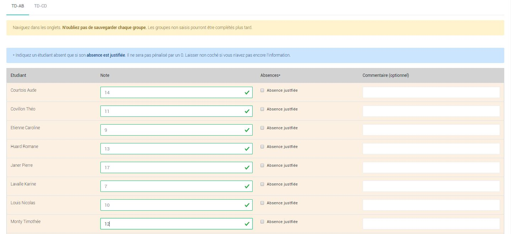
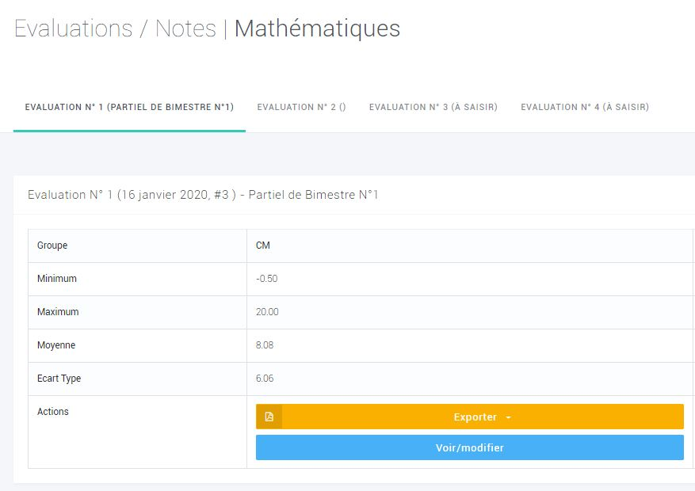
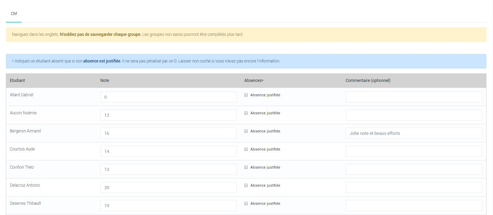
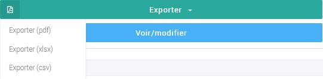
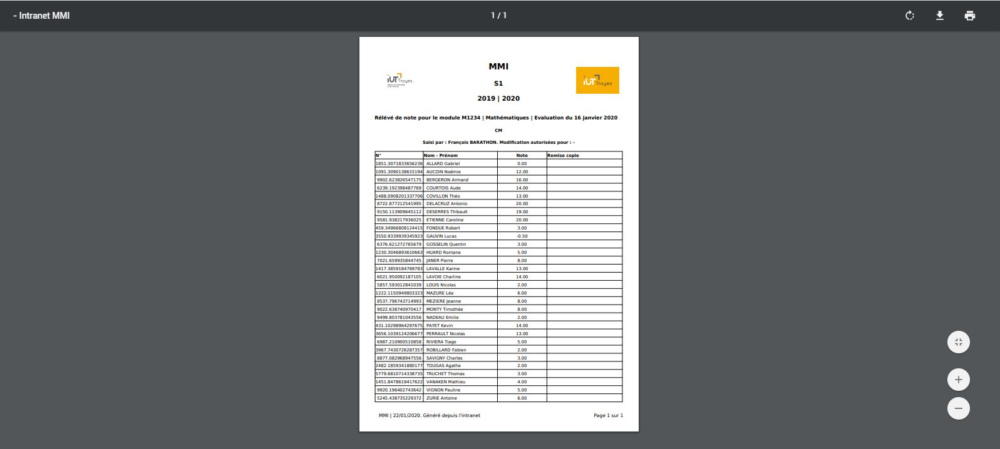
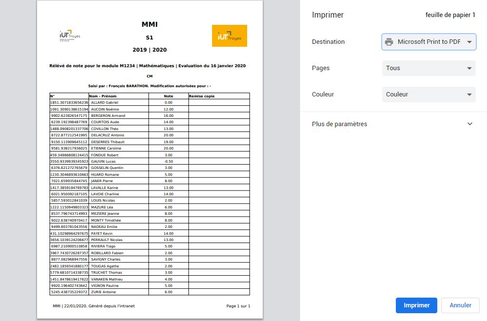

# Saisir, modifier une évaluation/note

### Comment saisir une note ?


_Attention ! Pour effectuer cette tâche vous devez au préalable vous connectez à votre **compte** **enseignant** ou votre **compte vacataire** \(voir la rubrique ci-dessus ou bien cliquez_ [_ici_](https://app.gitbook.com/@dannebicque/s/intranet/#comment-se-connecter-a-lintranet)_\)._




Pour saisir une note, il suffit de descendre en bas de la page **Dashboard** où un espace nommé **Mes cours** est dédié à vos différentes actions en tant que professeur. Sélectionnez un semestre puis cliquez sur **Saisir, voir ou modifier des notes :**

Choisissez une évaluation dans la liste puis cliquez sur **Saisir les notes :**

Remplissez les modalités du formulaire puis cliquez sur **Sauvegarder :**

À partir de cette étape, deux options s'offrent à vous :

* Importer les notes depuis un tableur
* Rentrer les notes directement ****sur le site



Cliquez sur **Choisir un fichier.** Une fenêtre s'ouvre, vous permettant de sélectionner un fichier .csv ou .xls sur votre ordinateur **:**

Une fois votre fichier choisi, cliquez sur **Importer le fichier de notes :**

\*\*\*\*



Descendez plus bas sur la page puis sélectionnez un groupe. Remplissez ensuite les champs, puis cliquez sur **Enregistrer les notes de ce groupe** pour valider votre saisie :





_**Vos notes ont bien été saisies.**_


### Comment modifier les notes ?


_Attention ! Pour effectuer cette tâche vous devez au préalable vous connectez à votre **compte** **enseignant** ou votre **compte vacataire** \(voir la rubrique ci-dessus ou bien cliquez_ [_ici_](https://app.gitbook.com/@dannebicque/s/intranet/#comment-se-connecter-a-lintranet)_\)._




Pour saisir une note, il suffit de descendre en bas de la page **Dashboard** où un espace nommé **Mes cours** est dédié à vos différentes actions en tant que professeur. Sélectionnez un semestre puis cliquez sur **Saisir, voir ou modifier des notes :**

Choisissez une évaluation dans la liste puis cliquez sur **Voir/modifier :**

Descendez plus bas sur la page puis sélectionnez un groupe. Modifiez vos notes, puis cliquez sur **Enregistrer les notes de ce groupe** pour valider votre saisie :


_**Vos notes ont bien été modifiées.**_


### Comment imprimer les notes ?


_Attention ! Pour effectuer cette tâche vous devez au préalable vous connectez à votre **compte** **enseignant** ou votre **compte vacataire** \(voir la rubrique ci-dessus ou bien cliquez_ [_ici_](https://app.gitbook.com/@dannebicque/s/intranet/#comment-se-connecter-a-lintranet)_\)._




Pour saisir une note, il suffit de descendre en bas de la page **Dashboard** où un espace nommé **Mes cours** est dédié à vos différentes actions en tant que professeur. Sélectionnez un semestre puis cliquez sur **Saisir, voir ou modifier des notes :**

Choisissez une évaluation dans la liste puis cliquez sur **Exportez :**

Pour imprimer les notes, cliquez sur **Exporter \(pdf\)** dans le sous-menu apparu au clic : 

Le téléchargement du fichier de notes \(.pdf\) se lance. Une fois celui-ci terminé, ouvrez le fichier en cliquant sur son nom :

Un nouvel onglet similaire à celui présenté ci-dessous doit s'ouvrir. Pour l'imprimer, utilisez la combinaison de touches **CTRL+P** ou cliquez sur le **pictogramme imprimante** en haut à droite :

Une fenêtre d'impression s'ouvre alors, avec un aperçu à gauche et un menu à droite. Choisissez une imprimante et les différents paramètres puis cliquez sur **Imprimer** : 


_**Votre fiche de note est imprimée.**_


