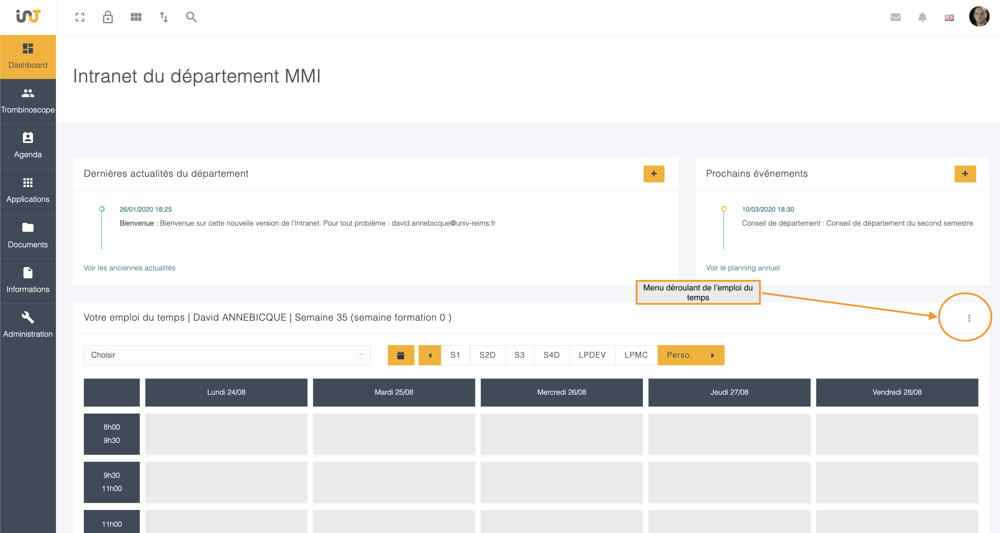
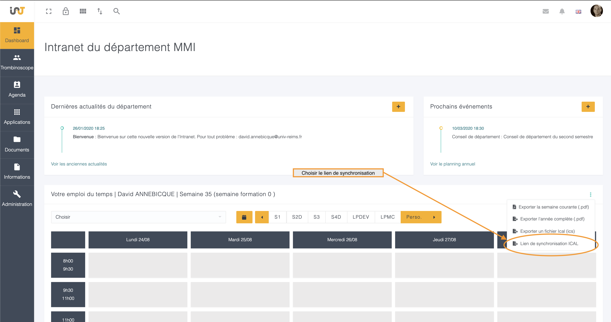
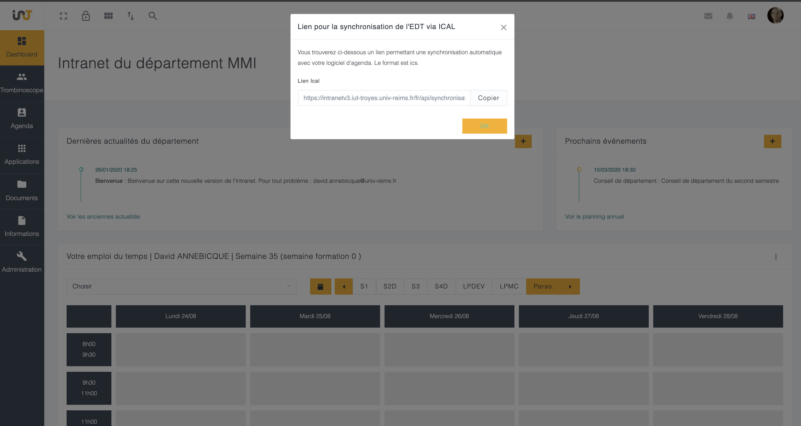

# Synchronisation Ical/Agenda

_Version du 27/08/2020_

Si l'emploi du temps est disponible sur l'intranet \(qu'il provienne de Celcat ou directement de l'intranet\), alors il est possible d'obtenir un lien de synchronisation entre l'intranet et votre outil d'agenda préféré compatible ics \(google agenda par exemple\).

Pour cela, sur le dashboard de l'intranet, choisir à droite du titre de l'emploi du temps le menu :

Plusieurs formats d'export sont à votre disposition, ainsi qu'un lien pour la synchronisation celcat. Ce lien est personnel et individuel et permet de récupérer votre emploi du temps.


Les étudiants disposent également de ces options d'exports, mais les mêmes limites de visibilités s'appliquent sur les semaines accessibles.


Un pop-up s'ouvre contenant le lien généré.

Il vous suffit ensuite de copier/coller ce lien dans votre outil d'agenda acceptant le format ics.

Vous trouverez par exemple la document pour Google Agenda ici : [https://support.google.com/calendar/answer/37100](https://support.google.com/calendar/answer/37100)


Parfois le bouton "copier" ne fonctionne pas dans le pop-up \(selon le navigateur\). Dans ce cas, faite un copier/coller classique \(souris ou raccourci clavier\)


